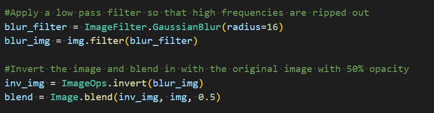
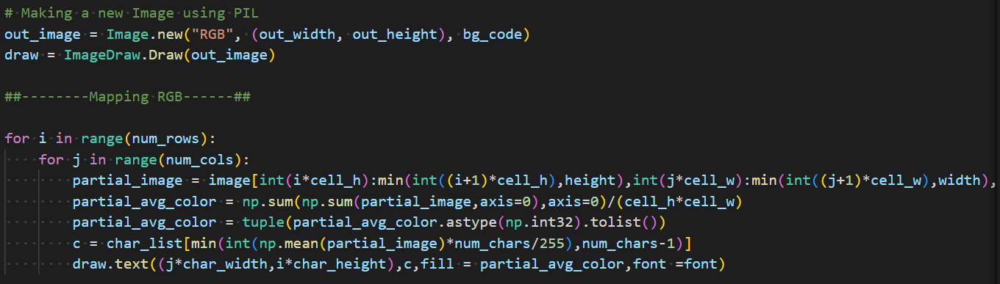
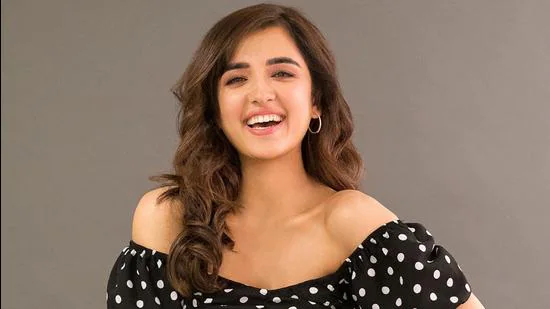
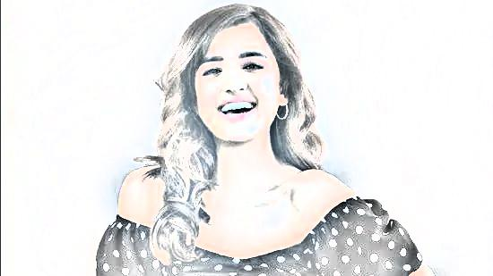
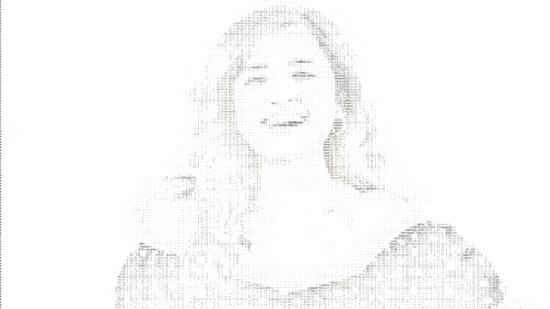

<h1 align="center">ASCII SKETCH GENERATOR</h1>

## Overview

Digital images are created using tiny rectangles called pixels. Here we use [ASCII characters](https://en.wikipedia.org/wiki/ASCII) to create sketch of the image. ASCII characters are of different shapes and sizes. So they have different intensities. We use this property to generate any ascii art.

## Dependencies

All the necessary python packages to run this project are listed in `requirements.txt` file. If you are not aware of how to install dependancies from requirements.txt file you can go through this [guide](https://packaging.python.org/en/latest/guides/installing-using-pip-and-virtual-environments/)

## How to use

- First clone the repository on your local machine using `git clone`.
- Now, install all the dependencies as mentioned above.
- After that you need a image for which you want to create an `ASCII Sketch`. So copy and paste an image in that folder.
- Last step is to compile all the neccesaary files which can be done by using `make image=filename` as a terminal command. Please note that the filename is the name of the image file in the current directory with its extension such as "image.jpg" .

Wait for a minute or two based on your CPU's processing power as it may take some time depending upon the quality of the photo.
Once done, you can see two image files generated named as `sketch.jpg` and `AsciiSketch.jpg`.

## Working

For better understanding, we can divide this project into two parts, in the first part we create an image `sketch.jpg` which is simply the sketch of the input image. Second we convert this sketch.jpg into its ascii image i.e, ascii sketch and the image file is named `AsciiSketch.jpg`

In the first part, we are making a sketch and for that we need rought parts of the image. So we pass the image through a low pass filter so that the higher frequencies are ripped out. Now, we invert the image and blend it with the original image so only rough part of the image remains(for which only high frequencies are responsible).

The formed image has a lot of grey areas. So we need to adjust the levels. For this we move the RGB space to HSV space, clamp the levels to a minimum(78), maximum(125) and gamma values(0.78)(Values for these variables are set this for better results) and convert it back to RGB. From this we get our `sketch.jpg` image.

Now, In the second part, we are converting this sketch to its ascii art. First we need a character list sorted on the basis of intensities.
Then, we need to decide the size of the ascii image that will be formed. We do this by setting the number of columns of characters in the image. This wil also define the qualtiy of the image formed.
Now, we fill the characters in each box of ascii image. The type and color of character is determined based on the average intensity and color of pixels.

## Demo

This is a small video demo for better understanding of this project.
[Drive Link](https://drive.google.com/file/d/1wm28DxqTV2R8mbiCSqKLW2QyfhU1repl/view?usp=sharing)

Input:

Output: sketch.jpg

 

AsciiSketch.jpg

## Resources/References

These are few links to blog posts which helped me understand how images work and how can i make sketches in a digital computer:
- [Ascii Art](https://turbofuture.com/graphic-design-video/Text-Drawings-Image-to-Ascii-Art)
- [Ascii Sketch](https://blog.waffles.space/2017/03/01/ascii-sketch/#fnref:2)
- [Digital Images](https://www.analyticsvidhya.com/blog/2021/03/grayscale-and-rgb-format-for-storing-images/)
